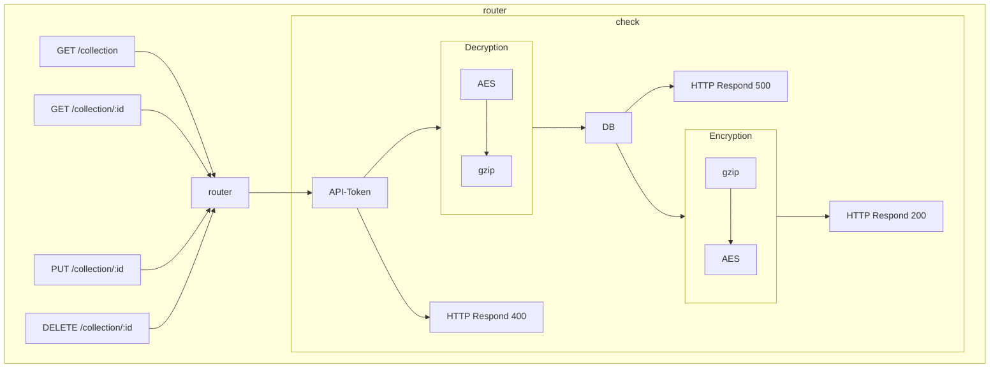
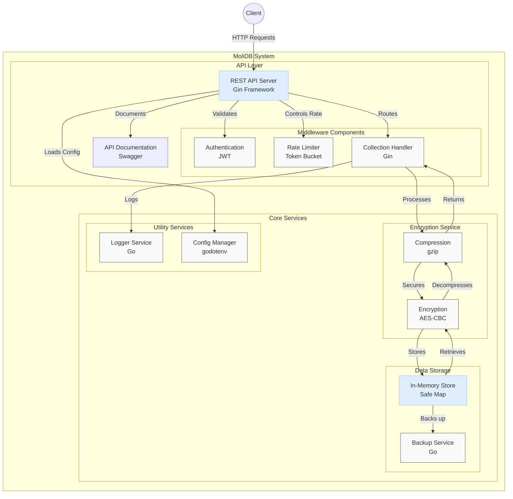

<div align="center">
  <h3>
    <a href="/README.md">KR</a> /
    <a href="/README.en.md">EN</a>
  </h3>
</div>
<div align="center">

  [](https://pypi.org/project/molidb/) [](https://www.npmjs.com/package/molidb)
</div>


### 🌟 **MoliDB - Secure Memory Database**

> **MoliDB** is an open-source, secure memory database that allows easy management of data through its **REST API**.  
All data is transmitted and received using **AES encryption**, ensuring sensitive information is handled securely.  
You can find client code examples in [example.md](/md/example.md).

---

### 🚀 **Installation Instructions**

Here are the steps to build and run the project:

> **⚠️Note**: Be sure to modify the `SECRET_KEY` and `API_KEY` values in the `.env` file before running the project.

#### **Running with Docker**

```sh
$ docker build -t molidb .
$ docker run -d -p 17233:17233 molidb
```

---

### 📦 **Installing the Client**

### Python  [](https://pypi.org/project/molidb/)

> To use the MoliDB client in Python, you can install the library from PyPI using the following command:

```bash
$ pip install molidb
```

#### 📜 Example Code (Python)

```py
from molidb import molidb

db = molidb() # You can modify the server URL, secret key, and API token here.
print(db.list_collection())
print(db.update_collection('user', [{'id':'molidb','money':10}]))
userlist = db.get_collection('user')
print(userlist)
for user in userlist:
    if user['id'] == 'molidb':
        user['money'] += 20
print(db.get_collection('user'))
print(db.update_collection('user', userlist))
print(db.list_collection())
```

---

### JavaScript  [](https://www.npmjs.com/package/molidb)

> To use the MoliDB client in JavaScript, you can install the library from npm using the following command:

```bash
$ npm install molidb
```

#### 📜 Example Code (JavaScript)

```js
const Molidb = require('molidb');

(async () => {
    try {
        const db = new Molidb(); // You can modify the server URL / secret key / API token here
        console.log(JSON.stringify(await db.listCollection()));
        console.log(JSON.stringify(await db.updateCollection('user', [{ id: 'molidb', money: 10 }])));
        let userlist = await db.getCollection('user');
        console.log(JSON.stringify(userlist));
        userlist.forEach(user => {
            if (user.id === 'molidb') {
                user.money += 20;
            }
        });
        console.log(JSON.stringify(await db.getCollection('user')));
        console.log(JSON.stringify(await db.updateCollection('user', userlist)));
        console.log(JSON.stringify(await db.listCollection()));
        await db.deleteCollection('user');
        console.log(JSON.stringify(await db.listCollection()));
    } catch (error) {
        console.error('Error:', error.message);
    }
})();
```

---

### 🔐 **Encryption Method**

- Step-by-step Process

1. **Data Compression (gzip)**  
   First, the data is compressed using the **gzip** algorithm. **gzip** reduces the size of the data, improving transmission and storage efficiency.

2. **Data Encryption (AES)**  
   The compressed data is encrypted using the **AES (Advanced Encryption Standard)** algorithm.  
   AES is a symmetric key encryption method, meaning the same key is used to both encrypt and decrypt the data.  
   The key used for this process is the `SECRET_KEY` from the `.env` file.

**This encryption process ensures both data efficiency and security.**


---

### 📡 **REST API Structure**



### 📍 **Router Explanation**

The router is responsible for handling client requests and returning appropriate responses. Each request is mapped to a specific endpoint and HTTP method, allowing the server to understand and process the client's request.

#### **Main Endpoints**

- `GET /collection`: Retrieves all collection data.
- `GET /collection/:id`: Retrieves collection data for a specific ID.
- `PUT /collection/:id`: Updates collection data for a specific ID.
- `DELETE /collection/:id`: Deletes collection data for a specific ID.

#### **Request Handling Process**

1. **Router**: The router receives the client’s request and routes it to the appropriate endpoint.
2. **API-Token Validation**: The API-Token included in the request is validated. If invalid, a 400 response is returned.
3. **Encryption/Decryption**: For valid requests, data is compressed using gzip and encrypted using AES before being stored in the database, or data retrieved from the database is decrypted and decompressed before being returned to the client.
4. **Response**: Depending on the outcome, either a 200 or 400 response is returned.

This structure allows the server to efficiently process client requests while maintaining data security and integrity.

---

### 🏗️ Overall Architecture



---

### 📜 **License**

`MoliDB` follows the **MIT License**. Please comply with the license terms if modifying or distributing the code.

Copyright © All rights reserved.
