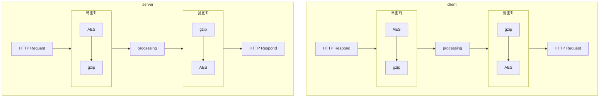
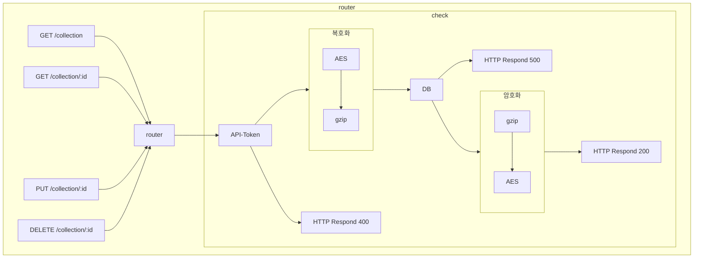
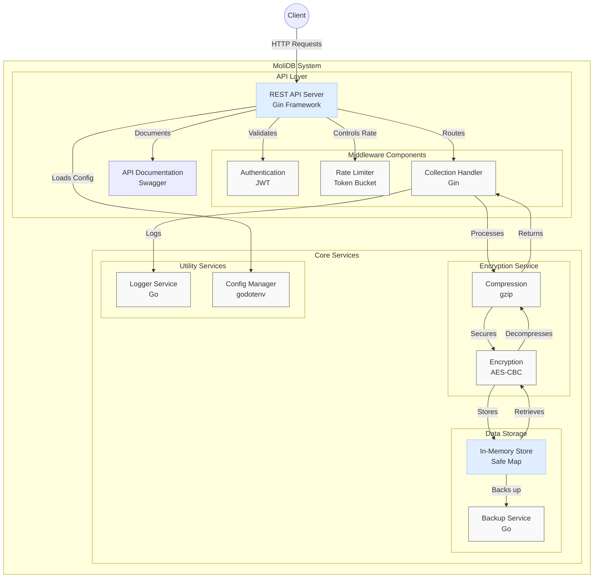

<div align="center">
  <h3>
    <a href="/README.kr.md">KR</a> /
    <a href="/README.md">EN</a>
  </h3>
</div>
<div align="center">

  [](https://pkg.go.dev/github.com/fluffy-melli/MoliDB) [](https://pypi.org/project/molidb/) [](https://www.npmjs.com/package/molidb)
</div>

### 🌟 **MoliDB - 안전한 메모리 데이터베이스**

> **MoliDB**는 오픈소스로 제공되는 안전한 메모리 데이터베이스로, **REST API**를 통해 데이터를 쉽게 다룰 수 있습니다.  
모든 데이터는 **AES 암호화 방식**으로 송수신되어, 민감한 정보도 안전하게 처리할 수 있습니다.  
클라이언트 코드 예제는 [example.md](/md/example.md)에서 확인할 수 있습니다.

> **허용되지 않은 IP는 접속이 거절됩니다**  
MoliDB는 설정된 허용 IP 목록에 포함되지 않은 IP로부터의 접속을 차단하여, 데이터베이스의 보안을 더욱 강화합니다.

> **⚠️주의**: config.json 안에 `allow-ip`가 빈 배열(`[]`)이라면, 모든 접속이 허용됩니다. 이 설정은 보안에 매우 취약할 수 있으므로, 신중하게 사용하세요.

--- 

### 🚀 **설치 방법**

프로젝트 빌드 및 실행 방법은 아래와 같습니다:

> **⚠️주의**: 실행 전에 `.env` 파일에서 `SECRET_KEY`와 `API_KEY` 값을 반드시 수정해 주세요.

#### **Docker로 실행하기**

```sh
$ docker build -t molidb .
$ docker run -d -p 17233:17233 molidb
```

---

### 📦 **클라이언트 설치**

###  [](https://pypi.org/project/molidb/)

> MoliDB 클라이언트를 Python에서 사용하려면 아래 명령어로 PyPI에서 라이브러리를 설치할 수 있습니다:

```bash
$ pip install molidb
```

#### 📜 예제 코드

```py
from molidb import molidb

db = molidb() # 서버 URL / 시크릿 키 / API 토큰은 여기서 수정할수 있어요
print(db.list_collection())
print(db.update_collection('user', [{'id':'molidb','money':10}]))
userlist = db.get_collection('user')
print(userlist)
for user in userlist:
    if user['id'] == 'molidb':
        user['money'] += 20
print(db.get_collection('user'))
print(db.update_collection('user', userlist))
print(db.list_collection())
```

---

###  [](https://www.npmjs.com/package/molidb)

> MoliDB 클라이언트를 JavaScript에서 사용하려면 아래 명령어로 npm에서 라이브러리를 설치할 수 있습니다:

```bash
$ npm install molidb
```

#### 📜 예제 코드
```js
const Molidb = require('molidb');

(async () => {
    try {
        const db = new Molidb(); // 서버 URL / 시크릿 키 / API 토큰은 여기서 수정할수 있어요
        console.log(JSON.stringify(await db.listCollection()));
        console.log(JSON.stringify(await db.updateCollection('user', [{ id: 'molidb', money: 10 }])));
        let userlist = await db.getCollection('user');
        console.log(JSON.stringify(userlist));
        userlist.forEach(user => {
            if (user.id === 'molidb') {
                user.money += 20;
            }
        });
        console.log(JSON.stringify(await db.getCollection('user')));
        console.log(JSON.stringify(await db.updateCollection('user', userlist)));
        console.log(JSON.stringify(await db.listCollection()));
        await db.deleteCollection('user');
        console.log(JSON.stringify(await db.listCollection()));
    } catch (error) {
        console.error('Error:', error.message);
    }
})();
```
---

### 🔐 암호화 방식

- 단계별 과정

1. 데이터 압축 (gzip)
먼저 데이터를 **gzip** 알고리즘을 사용하여 압축합니다. **gzip**은 데이터의 크기를 줄여 전송 및 저장 효율성을 높이는 데 사용됩니다.

2. 데이터 암호화 (AES)
압축된 데이터를 **AES(Advanced Encryption Standard)** 알고리즘을 사용하여 암호화합니다.
AES는 대칭 키 암호화 방식으로, 동일한 키를 사용하여 데이터를 암호화하고 복호화합니다.
이때 키는 `.env` 파일 안에 있는 `SECRET_KEY`를 사용합니다.

**암호화 과정 시 데이터 효율성과 보안을 동시에 고려할 수 있습니다.**



---

### 📡 REST API 구조



### 📍 라우터 설명

라우터는 클라이언트의 요청을 처리하고 적절한 응답을 반환하는 역할을 합니다. 각 요청은 특정 엔드포인트와 HTTP 메서드에 매핑되며, 이를 통해 서버는 클라이언트의 요청을 이해하고 처리할 수 있습니다.

#### 주요 엔드포인트

- `GET /collection`: 모든 컬렉션 데이터를 조회합니다.
- `GET /collection/:id`: 특정 ID를 가진 컬렉션 데이터를 조회합니다.
- `PUT /collection/:id`: 특정 ID를 가진 컬렉션 데이터를 업데이트합니다.
- `DELETE /collection/:id`: 특정 ID를 가진 컬렉션 데이터를 삭제합니다.

#### 요청 처리 과정

1. **라우터**: 클라이언트의 요청을 받아 적절한 엔드포인트로 라우팅합니다.
2. **API-Token 검사**: 요청에 포함된 API-Token을 검사하여 유효성을 확인합니다. 유효하지 않은 경우 400 응답을 반환합니다.
3. **암호화/복호화**: 유효한 요청의 경우, 데이터를 gzip으로 압축하고 AES로 암호화하여 데이터베이스에 저장하거나, 데이터베이스에서 가져온 데이터를 복호화하고 압축을 해제하여 클라이언트에 반환합니다.
4. **응답**: 처리 결과에 따라 200 또는 400 응답을 반환합니다.

이러한 구조를 통해 서버는 클라이언트의 요청을 효율적으로 처리하고, 데이터의 보안과 무결성을 유지할 수 있습니다.

---

### 🏗️ 전체 구조



---

### 📜 라이선스

`MoliDB`는 **MIT License**를 따릅니다. 코드를 수정하거나 배포할 경우, 라이선스 내용을 준수해 주세요.  

Copyright © All rights reserved.