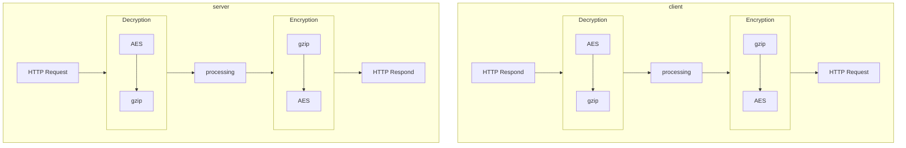
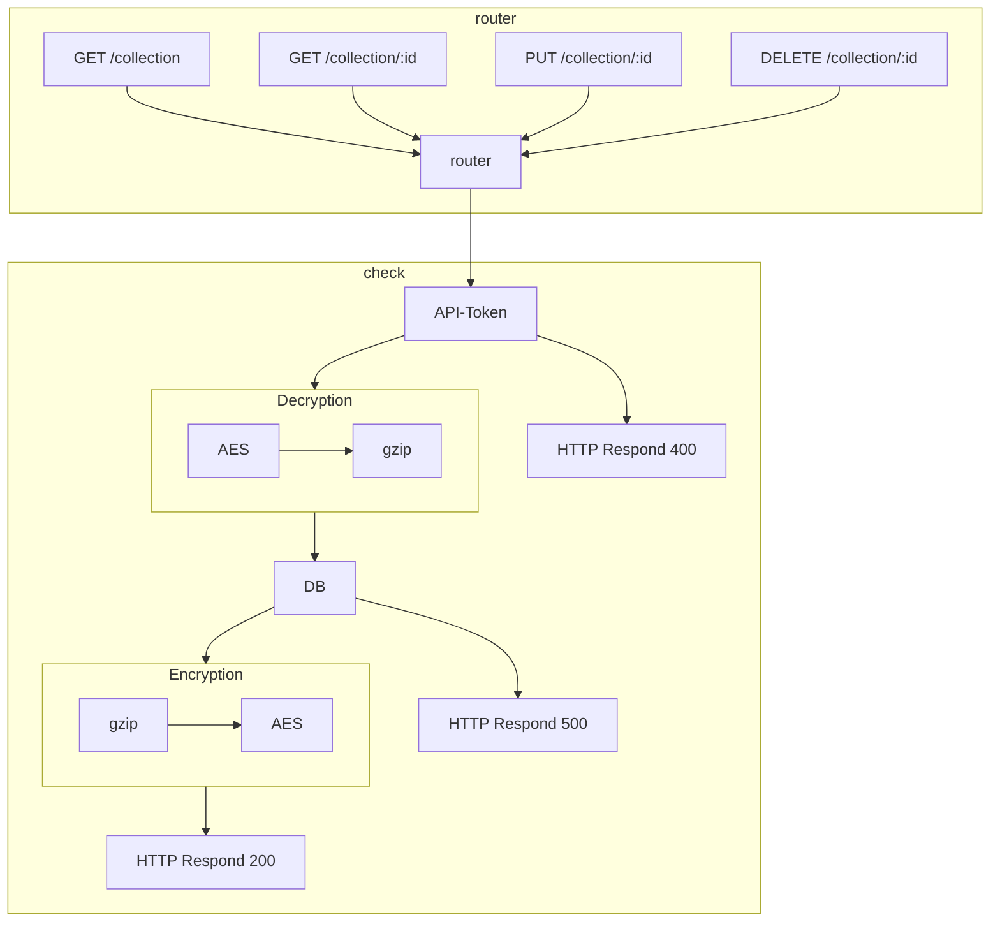

## Languages

- [한국어](architecture.md)
- [English](architecture.en.md)

## Encryption Method

### Step-by-Step Process

1. Data Compression (gzip)
First, compress the data using the gzip algorithm. gzip is used to reduce the size of the data, improving transmission and storage efficiency.

2. Data Encryption (AES)
Encrypt the compressed data using the AES (Advanced Encryption Standard) algorithm. AES is a symmetric key encryption method, meaning the same key is used to encrypt and decrypt the data. The key is taken from the `SECRET_KEY` in the `.env` file.

Using AES encryption after gzip compression allows you to reduce the size of the data while keeping it securely protected. This method provides both efficiency and security for data transmission and storage.

---

## REST API Structure

### Router Description

The router handles client requests and returns appropriate responses. Each request is mapped to a specific endpoint and HTTP method, allowing the server to understand and process the client's request.

#### Main Endpoints

- `GET /collection`: Retrieve all collection data.
- `GET /collection/:id`: Retrieve collection data with a specific ID.
- `PUT /collection/:id`: Update collection data with a specific ID.
- `DELETE /collection/:id`: Delete collection data with a specific ID.

#### Request Processing Flow

1. **Router**: Receives the client's request and routes it to the appropriate endpoint.
2. **API-Token Check**: Checks the API-Token included in the request for validity. If invalid, returns a 400 response.
3. **Encryption/Decryption**: For valid requests, compresses the data with gzip and encrypts it with AES for storage in the database, or decrypts and decompresses data retrieved from the database to return to the client.
4. **Response**: Returns a 200 or 400 response based on the processing result.

This structure allows the server to efficiently handle client requests while maintaining data security and integrity.