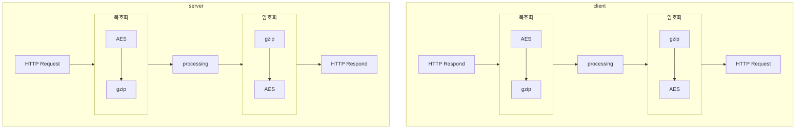
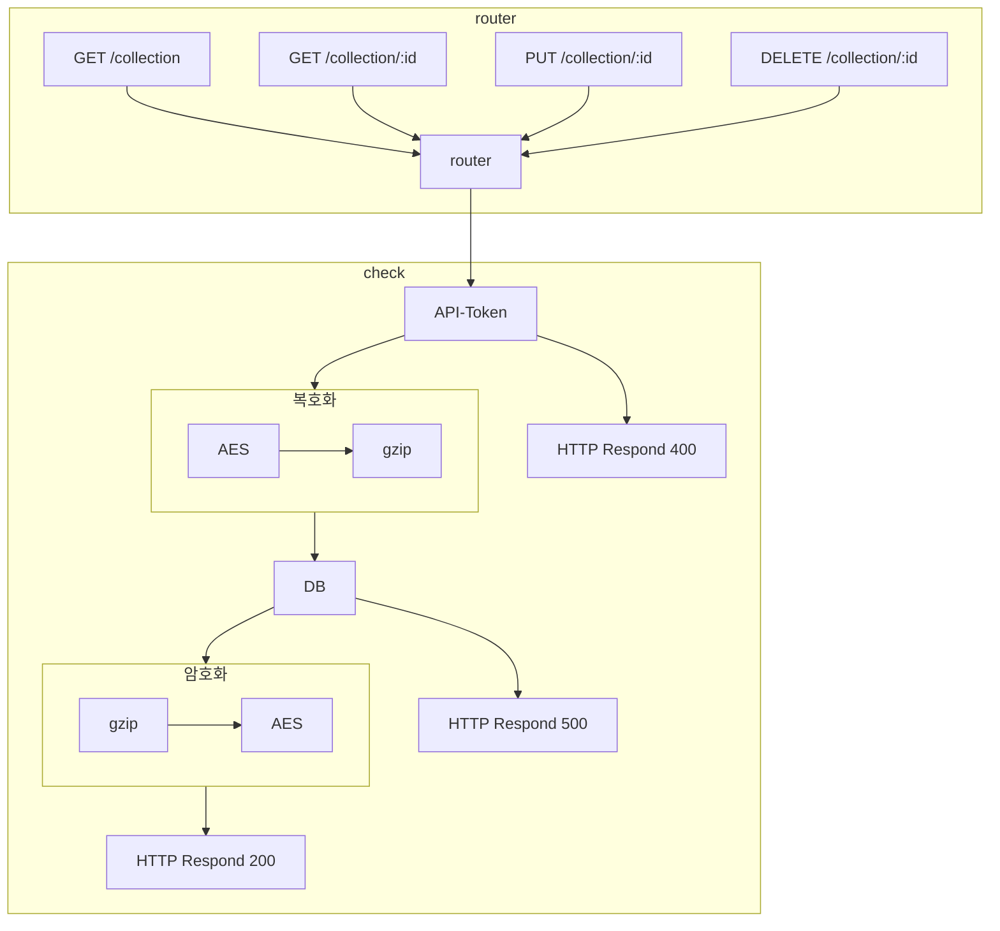

## Languages

- [한국어](architecture.md)
- [English](architecture.en.md)

## 암호화 방식

### 단계별 과정

1. 데이터 압축 (gzip)
먼저 데이터를 gzip 알고리즘을 사용하여 압축합니다. gzip은 데이터의 크기를 줄여 전송 및 저장 효율성을 높이는 데 사용됩니다.

2. 데이터 암호화 (AES)
압축된 데이터를 AES(Advanced Encryption Standard) 알고리즘을 사용하여 암호화합니다. AES는 대칭 키 암호화 방식으로, 동일한 키를 사용하여 데이터를 암호화하고 복호화합니다. 이때 키는 `.env` 파일 안에 있는 `SECRET_KEY`을 가져와 사용합니다.

gzip 압축 후 AES 암호화를 사용하면 데이터의 크기를 줄이면서도 안전하게 보호할 수 있습니다. 이 방식은 데이터 전송 및 저장 시 효율성과 보안을 동시에 제공합니다.

---

## REST API 구조

### 라우터 설명

라우터는 클라이언트의 요청을 처리하고 적절한 응답을 반환하는 역할을 합니다. 각 요청은 특정 엔드포인트와 HTTP 메서드에 매핑되며, 이를 통해 서버는 클라이언트의 요청을 이해하고 처리할 수 있습니다.

#### 주요 엔드포인트

- `GET /collection`: 모든 컬렉션 데이터를 조회합니다.
- `GET /collection/:id`: 특정 ID를 가진 컬렉션 데이터를 조회합니다.
- `PUT /collection/:id`: 특정 ID를 가진 컬렉션 데이터를 업데이트합니다.
- `DELETE /collection/:id`: 특정 ID를 가진 컬렉션 데이터를 삭제합니다.

#### 요청 처리 과정

1. **라우터**: 클라이언트의 요청을 받아 적절한 엔드포인트로 라우팅합니다.
2. **API-Token 검사**: 요청에 포함된 API-Token을 검사하여 유효성을 확인합니다. 유효하지 않은 경우 400 응답을 반환합니다.
3. **암호화/복호화**: 유효한 요청의 경우, 데이터를 gzip으로 압축하고 AES로 암호화하여 데이터베이스에 저장하거나, 데이터베이스에서 가져온 데이터를 복호화하고 압축을 해제하여 클라이언트에 반환합니다.
4. **응답**: 처리 결과에 따라 200 또는 400 응답을 반환합니다.

이러한 구조를 통해 서버는 클라이언트의 요청을 효율적으로 처리하고, 데이터의 보안과 무결성을 유지할 수 있습니다.